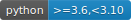
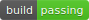
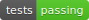
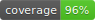
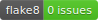
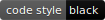

.. image:: _static/logo.svg
   :width: 350
   :alt: tslumen logo

.. raw:: html

     

*******************************************************
A library for exploratory analysis of Time Series data
*******************************************************

:brand:`tslumen` helps bring to light the key characteristics of your time
series data with rich, pre-canned artifacts, packed with charts and statistical
information. The primary goal of :brand:`tslumen` is to expedite and bring
consistency to how time series EDA is performed, allowing you to uncover the
fundamental aspects in seconds rather than hours or days.

Key features
#############
 - Platform agnostic, integrates nicely with your datascience workspace
 - Built on open source technology and research
 - Highly customizable and extensible
 - Data (profiling results) completely detached from the visuals
 - Can be executed from the command line
 - Efficient execution using parallel processing
 - Includes a great number of statistical information, including descriptive
   statistics statistical tests like KPSS or ADF, correlation, tsfeatures, etc.
 - Various plots specifically tailored to time series analysis
 - Self-contained HTML report that can easily be shared with interested parties
 - Fully interactive dashboard for a richer experience and detailed exploration

.. note::
   This package is still in incubation stage.
   Breaking changes to the API in between patch versions are to be expected.
   Similarly, the documentation is not guaranteed to always be up to date.

**Last updated**: |today|  **Version**: |version|

.. toctree::
   :maxdepth: 2
   :caption: Getting Started
   :hidden:

   installation
   quickstart
   issues

.. toctree::
   :maxdepth: 2
   :caption: User Guide
   :hidden:
   :glob:

   notebooks/*

.. toctree::
   :maxdepth: 2
   :caption: Credits and related work
   :hidden:

   thirdparty

.. toctree::
   :maxdepth: 2
   :caption: Reference
   :hidden:

   index_api
   genindex
   CONTRIBUTING
   CHANGELOG

